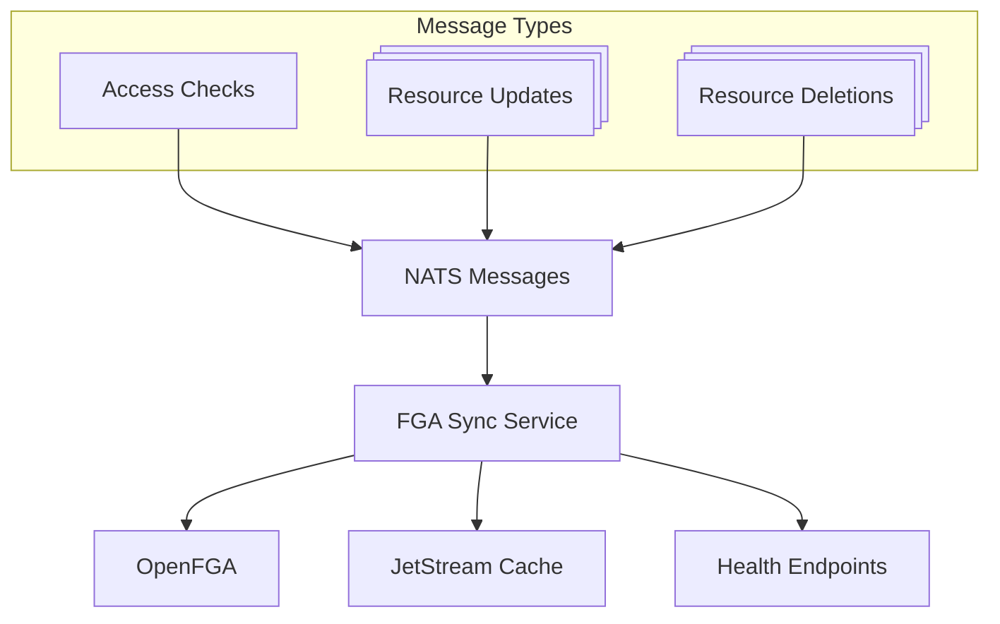

# LFX v2 FGA Sync Service


A high-performance microservice that synchronizes authorization data between NATS messaging and OpenFGA
(Fine-Grained Authorization), providing cached relationship checks and real-time access control updates for the
LFX Platform v2.

> Agents working in this repo should start with [`CLAUDE.md`](CLAUDE.md).
> The authoritative FGA Sync contract lives in
> [`docs/fga-sync-contract.md`](docs/fga-sync-contract.md); protected object
> inventory lives in [`docs/fga-protected-types.md`](docs/fga-protected-types.md).
> Service-owner onboarding lives in [`docs/fga-catalog.md`](docs/fga-catalog.md).

## 🚀 Features

- **Real-time Authorization Sync**: Synchronizes resource access tuples between NATS and OpenFGA
- **Cache-first Access Checks**: JetStream KV caching with global timestamp invalidation
- **Batch Operations**: Efficient bulk relationship checking and updates
- **Health Monitoring**: Kubernetes-ready health checks and observability
- **Security First**: Non-root container image, CodeQL, MegaLinter, and pinned workflow actions

## 📋 Architecture



### Components

- **Access Check Handler**: Processes authorization queries with intelligent caching
- **Generic Sync Handlers**: Manage `update_access`, `delete_access`,
  `member_put`, and `member_remove` for any OpenFGA model-defined resource type
- **Cache Layer**: JetStream KeyValue store for high-performance relationship caching

## 🛠️ Quick Start

### Prerequisites

- Go 1.25+
- Kubernetes 1.19+
- Helm 3.2.0+
- Docker (optional)

Dependencies you need but should get from [lfx-v2-helm](https://github.com/linuxfoundation/lfx-v2-helm/blob/main/charts/lfx-platform/README.md):

- NATS Server with JetStream enabled
- OpenFGA Server

### Local Development

1. **Clone the repository**:

   ```bash
   git clone https://github.com/linuxfoundation/lfx-v2-fga-sync.git
   cd lfx-v2-fga-sync
   ```

2. **Install dependencies**:

   ```bash
   # Installs Go dependencies
   make deps
   ```

   IMPORTANT: Install the lfx-platform Helm chart to get all of the dependencies running in a Kubernetes cluster.
   Follow the instructions from [lfx-v2-helm](https://github.com/linuxfoundation/lfx-v2-helm/blob/main/charts/lfx-platform/README.md).
   It is expected that you have the chart installed for the rest of the steps.

3. **Set up OpenFGA store and authorization model**:

    You should already have the OpenFGA store and authorization model configured if you are running the lfx-platform
    helm chart. Read more about the use of OpenFGA and ensuring that you have it configured:
    <https://github.com/linuxfoundation/lfx-v2-helm/blob/main/docs/openfga.md>

    If you are running your own instance of OpenFGA locally, you need to create a store and then an authorization model
    with the same content from
    <https://github.com/linuxfoundation/lfx-v2-helm/blob/main/charts/lfx-platform/templates/openfga/model.yaml>.
    The authorization model expected by this service is maintained there.

4. **Set environment variables**:

   ```bash
   # This assumes you have the lfx-platform chart running
   # from https://github.com/linuxfoundation/lfx-v2-helm/tree/main
   export NATS_URL="nats://lfx-platform-nats.lfx.svc.cluster.local:4222"
   export OPENFGA_API_URL="http://lfx-platform-openfga.lfx.svc.cluster.local:8080"
   export OPENFGA_STORE_ID="01K1GTJZW163H839J3YZHD8ZRY"  # Use your actual store ID if you aren't using the lfx-platform chart
   export OPENFGA_AUTH_MODEL_ID="01K1H4TFHDSBCZVZ5EP6HHDWE6"   # Use your actual model ID if you aren't using the lfx-platform chart
   export CACHE_BUCKET="fga-sync-cache"
   export USE_CACHE=true
   export DEBUG=false
   ```

5. **Create the NATS KeyValue cache bucket**:

   ```bash
   # Using NATS CLI (if available)
   nats kv add fga-sync-cache --history=20 --storage=file --max-value-size=10485760 --max-bucket-size=1073741824

   # Or using kubectl if running in Kubernetes
   kubectl exec -n lfx deploy/nats-box -- nats kv add fga-sync-cache --history=20 --storage=file --max-value-size=10485760 --max-bucket-size=1073741824 --ttl=3h
   ```

6. **Run the service**:

   ```bash
   make run
   ```

### Docker Deployment

```bash
# Build the image (replace the version as needed)
docker build -t linuxfoundation/lfx-v2-fga-sync:0.1.0 .

# Or use Make
make docker-build

# Run the container
docker run -d \
  -e NATS_URL=nats://lfx-platform-nats.lfx.svc.cluster.local:4222 \
  -e OPENFGA_API_URL=http://lfx-platform-openfga.lfx.svc.cluster.local:8080 \
  -e OPENFGA_STORE_ID=01K1GTJZW163H839J3YZHD8ZRY \
  -e OPENFGA_AUTH_MODEL_ID=01K1H4TFHDSBCZVZ5EP6HHDWE6 \
  -e CACHE_BUCKET=fga-sync-cache \
  -p 8080:8080 \
  linuxfoundation/lfx-v2-fga-sync:latest
```

### Kubernetes Deployment

```bash
# Deploy using Helm
helm install lfx-v2-fga-sync ./charts/lfx-v2-fga-sync -n lfx

# Or use Make
make helm-install

# Optionally deploy with custom local values (values.local.yaml) instead
# Create a values.local.yaml file in charts/lfx-v2-fga-sync/ with your custom values
make helm-install-local
```

## 🔧 Configuration

### Environment Variables

| Variable | Description | Default | Required |
|----------|-------------|---------|----------|
| `NATS_URL` | NATS server connection URL | `nats://localhost:4222` | Yes |
| `OPENFGA_API_URL` | OpenFGA API endpoint | - | Yes |
| `OPENFGA_STORE_ID` | OpenFGA store ID | - | Yes |
| `OPENFGA_AUTH_MODEL_ID` | OpenFGA authorization model ID | - | Yes |
| `CACHE_BUCKET` | JetStream KeyValue bucket name | `fga-sync-cache` | No |
| `USE_CACHE` | Whether to try to use cache for access checks | `false` | No |
| `PORT` | HTTP server port | `8080` | No |
| `DEBUG` | Enable debug logging | `false` | No |

Note: if you are developing locally and are writing to the OpenFGA store outside of this service
(e.g. granting certain access to a test user manually) then you should set `USE_CACHE=false`,
because otherwise access checks will use the cached access tuples even though they are out of date.

## 📚 Documentation

| Document | Description |
| --- | --- |
| [docs/fga-sync-contract.md](docs/fga-sync-contract.md) | Authoritative generic FGA envelope, subjects, tuple format, cache behavior, and access-check semantics |
| [docs/fga-protected-types.md](docs/fga-protected-types.md) | Inventory of services, object types, and supported FGA sync operations |
| [docs/client-guide.md](docs/client-guide.md) | NATS API reference, request/reply queries, sync message formats, and integration examples |
| [docs/fga-catalog.md](docs/fga-catalog.md) | Onboarding checklist for service owners adding FGA sync to a resource service |

## 📊 API Reference

### Health Endpoints

#### Liveness Probe

```http
GET /livez
```

Returns `200 OK` if the service is running.

#### Readiness Probe  

```http
GET /readyz
```

Returns `200 OK` if the service is ready to handle requests (NATS connected).

### NATS API

The service subscribes to the following NATS subjects. See [docs/client-guide.md](docs/client-guide.md) for message
formats, examples, and integration guidance.

#### Request/Reply Subjects

| Subject | Description |
|---------|-------------|
| `lfx.access_check.request` | Check one or more authorization relationships |
| `lfx.access_check.read_tuples` | Return all direct OpenFGA tuples for a user + object type |

#### Sync Subjects

| Subject | Description |
|---------|-------------|
| `lfx.fga-sync.update_access` | Create/update access control for a resource |
| `lfx.fga-sync.delete_access` | Delete all access control for a resource |
| `lfx.fga-sync.member_put` | Add member(s) with one or more relations |
| `lfx.fga-sync.member_remove` | Remove member relations |

## 🧪 Development

### Running Tests

```bash
# Run all tests
make test

# Run tests with coverage
make test-coverage

# Run specific test
go test -v ./... -run TestAccessCheckHandler
```

### Code Quality

```bash
# Format code
make fmt

# Run linter
make lint

# Run go vet
make vet

# Run all quality checks
make check
```

### Building

```bash
# Build for current platform
make build

# Build for multiple platforms
make build-all

# Build development version (with debug symbols)
make dev
```

## 📈 Performance

This service uses cache-first access checks and batches OpenFGA writes in groups
of up to 100 operations, matching the OpenFGA Write API limit. No benchmark
numbers are claimed in this README; verify workload-specific throughput and
latency in the target environment.

### Caching Strategy

1. **Cache Key Format**: `rel.{base32-encoded-relation}`
2. **Cache Values**: raw `true` / `false` strings; freshness comes from NATS KV entry timestamps
3. **Cache Invalidation**: global `inv` timestamp marker written after successful OpenFGA writes
4. **Cache TTL**: Configurable via JetStream bucket settings
5. **Fallback**: Direct OpenFGA queries on cache miss or stale hit

## 🛡️ Security

- **Principle of Least Privilege**: Runs as a non-root user in the runtime image
- **Minimal Runtime Image**: Uses Chainguard static runtime image for the final container
- **Security Scanning**: Automated CodeQL and MegaLinter workflows
- **Secret Management**: No secrets should be committed; deployment-owned values come from environment or cluster injection

## 🔍 Monitoring

### Metrics

The service exposes metrics via expvar at `/debug/vars`:

- `cache_hits` - Number of successful cache lookups
- `cache_stale_hits` - Number of stale cache entries detected and rechecked
- `cache_misses` - Number of cache misses requiring OpenFGA queries

### Logging

Structured JSON logging with configurable levels:

```bash
# Enable debug logging
export DEBUG=true

# View logs in development
make run 2>&1 | jq '.'
```

## 🚢 Deployment

### Helm Chart

The repository includes a production-ready Helm chart:

```yaml
# values.yaml
application:
  replicas: 3
  resources:
    requests:
      memory: "64Mi"
      cpu: "100m"
    limits:
      memory: "128Mi" 
      cpu: "500m"

nats:
  url: "nats://lfx-platform-nats.lfx.svc.cluster.local:4222"

fga:
  apiUrl: "http://lfx-platform-openfga.lfx.svc.cluster.local:8080"
```

### Production Considerations

- **Horizontal Scaling**: Multiple replicas supported with NATS queue groups
- **Resource Limits**: Configure appropriate CPU/memory limits
- **Network Policies**: Restrict traffic to NATS and OpenFGA only
- **Monitoring**: Set up alerts for cache hit rates and error rates

## Releases

### Creating a Release

To create a new release of the fga-sync service:

1. **Update the chart version** in `charts/lfx-v2-fga-sync/Chart.yaml` prior to any project releases, or if any
   change is made to the chart manifests or configuration:

   ```yaml
   version: 0.2.0  # Increment this version
   appVersion: "latest"  # Keep this as "latest"
   ```

2. **After the pull request is merged**, create a GitHub release and choose the
   option for GitHub to also tag the repository. The tag must follow the format
   `v{version}` (e.g., `v0.2.0`). This tag does _not_ have to match the chart
   version: it is the version for the project release, which will dynamically
   update the `appVersion` in the released chart.

3. **The GitHub Actions workflow will automatically**:
   - Build and publish the container images
   - Package and publish the Helm chart to GitHub Pages
   - Publish the chart to GitHub Container Registry (GHCR)
   - Sign the chart with Cosign
   - Generate SLSA provenance

### Important Notes

- The `appVersion` in `Chart.yaml` should always remain `"latest"` in the committed code.
- During the release process, the `ko-build-tag.yaml` workflow automatically overrides the `appVersion` with the actual
tag version (e.g., `v0.2.0` becomes `0.2.0`).
- Only update the chart `version` field when making releases - this represents the Helm chart version.
- The container image tags are automatically managed by the consolidated CI/CD pipeline using the git tag.
- Both container images and the Helm chart are published together in a single workflow.

## 🤝 Contributing

1. Fork the repository
2. Create a feature branch (`git checkout -b feature/amazing-feature`)
3. Make your changes
4. Run tests (`make test`)
5. Run quality checks (`make check`)
6. Commit your changes to a feature branch in your fork. Ensure your commits
   are signed with the [Developer Certificate of Origin
   (DCO)](https://developercertificate.org/).
   You can use the `git commit -s` command to sign your commits.
7. Ensure the chart version in `charts/lfx-v2-fga-sync/Chart.yaml` has been
   updated following semantic version conventions if you are making changes to the chart.
8. Push to the branch (`git push origin feature/amazing-feature`)
9. Open a Pull Request

### Code Standards

- Follow Go best practices and idioms
- Use structured logging with appropriate levels
- Include comprehensive error handling
- Update documentation for new features
- Add unit tests for features

## 📄 License

This project is licensed under the MIT License - see the [LICENSE](LICENSE) file for details.
